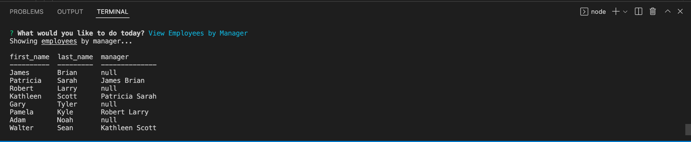

# Employee-Tracker

  

## Description

The Employee Tracker app is **content management systrem (CMS)** to manage a company's employee database. A command-line application to manage a company's database, using Node.js, Inquirer, and MySQL. The users are able to view and manage the departments, roles and employees in their company, so they can organize and plan their business. On the user's terminal they need to login use `mysql -u root -p` and login, then create database employee_db, use `schema.sql and seeds.sql` but they need to modify department, role and employee on seeds.sql.

## Table of Contents (Optional)

- [Installation](#installation)
- [Usage](#usage)
- [Credits](#credits)
- [License](#license)
- [Badges](#badges)
- [Features](#features)
- [Contributing](#contributing)
- [Tests](#tests)

## Installation
- Create `.gitignore` and include `node_modules` and `.DS_Store/`, then Install `npm` to acquire inquirer package. 
- Install `npm install --save mysql2` to use the [MySql2], add `npm i console-table` method that prints an array of objects as a table in console and also `npm i dotenv` the [dotenv] package to use environment variables to store sensitive data.

## Usage

Open terminal, then type `node index.js` or `npm start` and entered, then answer the prompts that follow.
As a user, WHEN I start the application
THEN I am presented with the following options: view all departments, view all roles, view all employees, add a department, add a role, add an employee, and update an employee role
WHEN I choose to view all departments
THEN I am presented with a formatted table showing department names and department ids
WHEN I choose to view all roles
THEN I am presented with the job title, role id, the department that role belongs to, and the salary for that role
WHEN I choose to view all employees
THEN I am presented with a formatted table showing employee data, including employee ids, first names, last names, job titles, departments, salaries, and managers that the employees report to
WHEN I choose to add a department
THEN I am prompted to enter the name of the department and that department is added to the database
WHEN I choose to add a role
THEN I am prompted to enter the name, salary, and department for the role and that role is added to the database
WHEN I choose to add an employee
THEN I am prompted to enter the employee’s first name, last name, role, and manager, and that employee is added to the database
WHEN I choose to update an employee role
THEN I am prompted to select an employee to update and their new role and this information is updated in the database.
Also the user can:

* Update employee managers.

* View employees by manager.

* View employees by department.

* Delete departments, roles, and employees.

* View the total utilized budget of a department&mdash;in other words, the combined salaries of all employees in that department.

## Demo

- A walkthrough video on [Screencastify](https://drive.google.com/file/d/1VsD51oFTYQh9YmbeghLuB1HGBdEMqj--/view)

## Credits

- [Simon-Xu-Lan](https://github.com/Simon-Xu-Lan)
- [Sam-Ngu](https://github.com/sam-ngu)
- [Chee-Tai](https://github.com/cupacheeno)

## License
    This application is covered by the MIT license.

---
## Badges

## Features
n/a

## Contributing
Pull request are welcome, you can make a constribution at the bottom of any docs page to make small changes such as a typo, sentence fix or a broken link. For major changes, please open an issue first to discuss what you would like to change.

## Tests

n/a

## Questions

If you have any question, Email me at: djaja@iinet.net.au 

Find me on GitHub: [B-smd](https://github.com/B-smd)   

